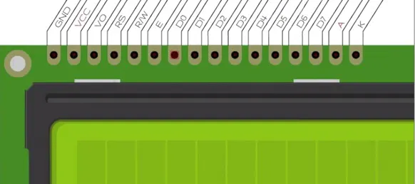

### **Midas MC11605A12W-VNMLB**

#### **General Specification**

- Number of Characters: 16 characters x 1 Line
- Character size: 3.07 x 6.56 mm
- LCD type: VA Negative Trans-missive
- View direction: 12 o’clock
- Back-light Type: LED, Blue(High light)
- IC:RW1063 

#### **PINS**

#### **Arduino Mapping**

| Pin | Symbol | Arduino pin | Description |
| --- | ------ | ----------- | ----------- |
| 1 | GND | Ground | Ground |
| 2 | VCC | +5V | +5V |
| 3 | VO | - | Contrast |
| 4 | RS | 12 | LCD Instruction |
| 5 | R/W | Ground | Read/Write |
| 6 | E | 11 | Chip Enable |
| 7 | D0 | - | Data |
| 8 | D1 | - | Data |
| 9 | D2 | - | Data |
| 10 | D3 | - | Data |
| 11 | D4 | 2 | Data |
| 12 | D5 | 3 | Data |
| 13 | D6 | 4 | Data |
| 14 | D7 | 5 | Data |
| 15 | A | +5V | +5V (back-light) |
| 16 | K | Ground | Ground (back-light) |

